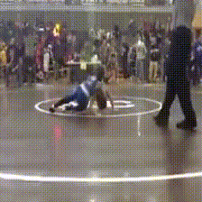

# Recognizing Violent Human Actions in Video


## Projet Overview

### Dataset

The dataset is a subset of the Kinetics dataset (include reference). Kinetics comprises a set of 400 general human action classes, each class having a total of 400 video samples in average, taken from YouTube videos. From this dataset, we created ViolentHumanActions_v2, comprising 20 classes, 9 of which are true violent actions, and the rest being non violent actions, but resembling violent ones. The non-violent actions were selected among the most frequent wrong predictions, when evaluating the model on the violent classes only.

The dataset has a train, valid and test split, each respectively accounting for roughly 80%, 15% and 5% of the whole dataset.

The dataset is located in `/datasets/ViolentHumanActions_v2`. It each split has a .csv file, each line starting by an action label, and the corresponding video filename.

```
        ViolentHumanActions_v2
    ______________|________________
    |       |           |         |
  data    train.csv  valid.csv  test.csv
____|___________        
|       |      |        
train  valid  test
|_________________________
    |       |            |
 class_0   class_1 ... class_N
    |       |____________________
    |                           |
videos for class_0    videos for class_1
```


### Model architecture

The model is based on the i3D two-stream architecture (include reference), which uses a model trained on clips as sequences of RGB frames, and the other is trained on sequences of optical-flow frames. Both models are a 3D inflated variant of the Inception model (check official name of model). The mode is implemented in `/models/i3d/i3d.py`

### Pre-processing

Since numerical arrays of uncompressed videos require much more space (rephrase), saving the dataset in RGB and optical-flow pre-processed format is unfeasible. Therefore, the dataset is made of compressed video files, and pre-processing is computed on-the-fly, as videos are loaded and fed to the network. See `preprocessing.py` for details on the pre-processing stage.


## Setting up the project


### Cloning the repository:
`$ git clone https://github.com/simonguiroy/RecognizingViolentActions.git`

### Environment setup

1. Install Anaconda, if not already done, by following these instructions:
https://docs.anaconda.com/anaconda/install/linux/  

2. Create a conda environment using the `environment.yaml` file, to install the dependencies:  
`$ conda env create -f environment.yaml`

3. Activate the new conda environment:
`$ conda activate RecognizingViolentActions`


### Getting the data
`$ python download_dataset.py`


## Running experiments

### Training the models

Models are trained by stochastic gradient descent. Default hyperparameters are
- learning rate: 0.001
- momentum: 0.9
- batch size: 5
- maximum number of frames per clip: 60 (this is a max value, since some clips may have fewer frames, even if clips have in average 250 frames)

All hyperparameters and other options are detailed `parser.py`.

The RGB and optical-flow models are trained independently, with each type specified by the `--stream` argument. Models are saved at every end of epoch in `/out/i3d/saved_models`, and training log files are saved in `/out/i3d/logs/`.


`$ python train.py --stream rgb --num_epochs 1`

Training can be resumed at a given epoch by using the `--resume_epoch` argument:  
`$ python train.py --stream rgb --resume_epoch 1`

The project already contains checkpoints for the RGB and optical-flow models, pre-trained on Kinetics-400, and are saved under the names `i3d_rgb_epoch-0.pkl` and `i3d_flow_epoch-0.pkl`.

### Testing the models

The rgb and optical-flow models are first tested indepedently. To test a model, specify the saved checkpoint. Testing results are saved in log files in `/out/i3d/logs`, and the model predictions are saved in `out/i3d/preds`.

To test the two stream joint predictions, the predictions of an RGB and an optical-flow model are averaged. To do so, specify the saved predictions of both the RGB and optical-flow model:

`$ python test-joint --rgb_preds_path out/i3d/preds/preds_rgb_epoch-0.pkl --flow_preds_path out/i3d/preds/preds_flow_epoch-0.pkl --output_file joint-test_epoch_0.csv`


## Results

**Demonstration of a video classification using averaged predictions:**

RGB pred: Dancing         |Flow pred: Wrestling          |Joint pred: Wrestling          |
:-------------------------------:|:-------------------------------:|:-------------------------------:
  |    |              


  

The following results show the top-1 testing accuracy using the RGB, optical-flow, and joint predictions. It also shows results after fine-tuning the RGB model on ViolentHumanActions_v2 for 3 epochs (using the default hyperparameters):

**Testing accuracy:**

Model          | Pre-trained on Kinetics | Fine-tuned
-------------- | :-----------------: | -----------
RGB-I3D        | 0.6014         | 0.7210
Flow-I3D       | 0.6159         | -
Two-Stream I3D | 0.6630         | 0.7391


